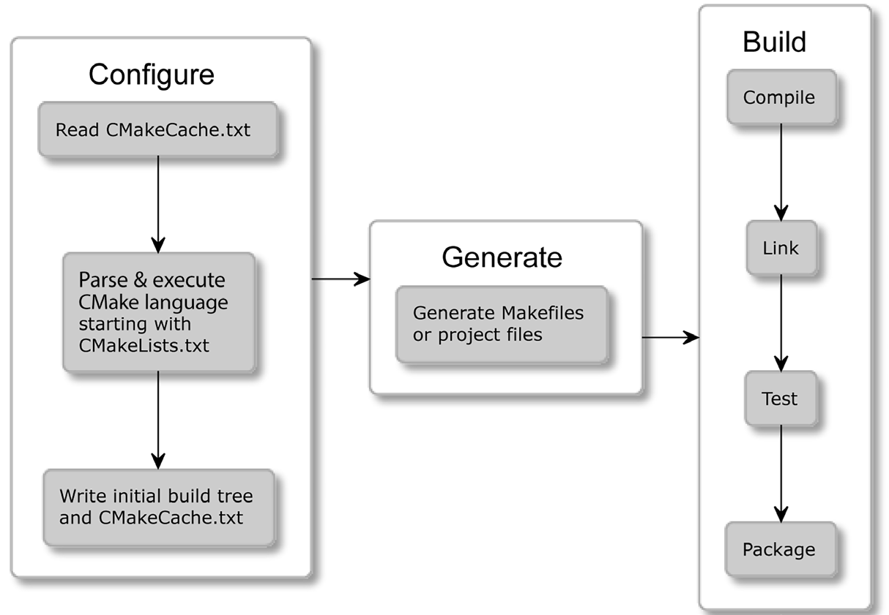

CMake 有三个阶段：
- 配置
- 生成
- 构建

## 配置阶段 
读取存储在目录中的项目信息，称为源码树，并为生成阶段准备一个输出目录或构建树。

CMake 首先检查项目是否以前配置过，并从 `CMakeCache.txt` 文件中读取缓存的配置变量。首次运行时，它会创建一个空的构建树，并收集它正在工作的环境的所有详细信息：例如，架构，可用的编译器，以及是否安装了链接器和打包器。此外，还会检查一个简单的测试程序是否可以正确编译。

接下来，`CMakeLists.txt` 项目配置文件被解析并执行（ CMake 语言进行配置）。这个文件是 CMake 项目的最小配置（源文件可以在稍后添加），告诉 CMake 关于项目结构、其目标和依赖项（库和其他 CMake 包）。

这个过程中，CMake 将收集的信息存储在构建树中，例如系统详情、项目配置、日志和临时文件，这些信息会用于下一阶段。具体来说，`CMakeCache.txt` 文件用于存储更稳定的信息（例如编译器和工具的路径），这在整个构建序列再次执行时可以节省时间。

## 生成阶段
读取项目配置后，CMake 将为确切的环境生成一套构建系统。构建系统只是为其他构建工具 （例如，GNU Make 的 Makefiles 或 Ninja，以及 Visual Studio 的 IDE 项目文件）定制的配置文件。在这个阶段，CMake 仍然可以通过计算生成器表达式对构建配置进行一些调整。

>[!tip]
>生成阶段在配置阶段之后自动执行。

## 构建阶段 
为了生成项目中指定的最终产物（如可执行文件和库），CMake 必须运行适当的构建工具。这可以通过直接调用、通过 IDE 或使用适当的 CMake 命令来执行。反过来，这些构建工具将执行一系列步骤，使用编译器、链接器、静态和动态分析工具、测试框架、报告工具，以及其他工具来生成目标产品。这种解决方案的美丽之处在于，能够根据需要为每个平台生成构建系统（使用相同的项目文件）：
