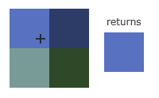
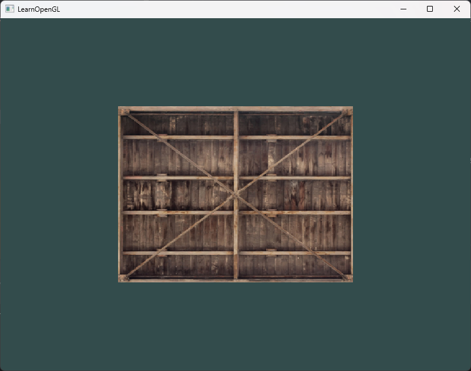
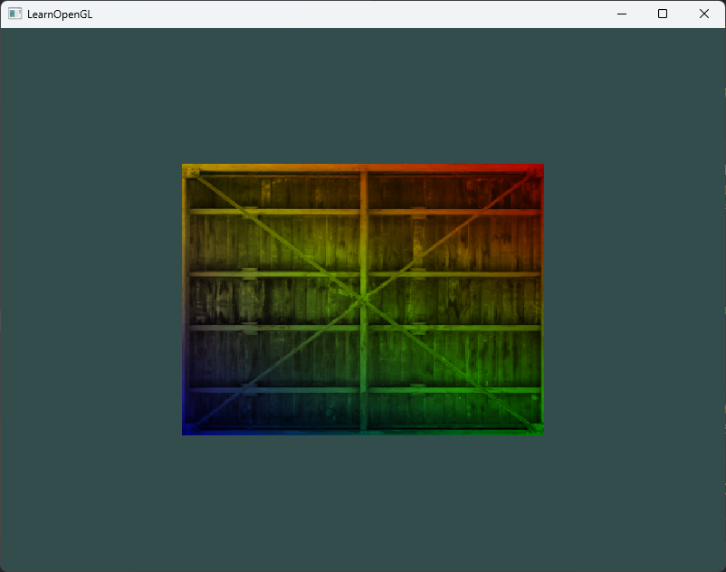
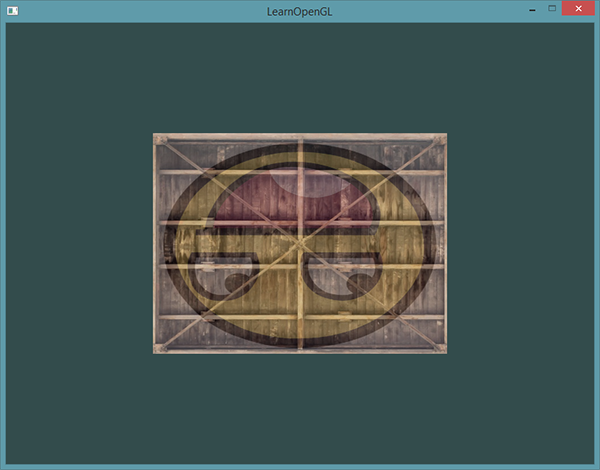

我们可以为每个顶点添加颜色来增加图形的细节，从而创建出有趣的图像。但是，如果想让图形看起来更真实，我们就必须有足够多的顶点，从而指定足够多的颜色。这将会产生很多额外开销，因为每个模型都会需求更多的顶点，每个顶点又需求一个颜色属性。

所以一般更喜欢使用纹理 (Texture)。纹理是一个2D 图片（甚至也有1D 和3D 的纹理），它可以用来添加物体的细节；你可以想象纹理是一张绘有砖块的纸，无缝折叠贴合到你的3D 的房子上，这样你的房子看起来就像有砖墙外表了。因为我们可以在一张图片上插入非常多的细节，这样就可以让物体非常精细而不用指定额外的顶点。

> 除了图像以外，纹理也可以被用来储存大量的数据，这些数据可以发送到着色器上。

为了能够把纹理映射 (Map)到三角形上，我们需要指定三角形的每个顶点分别对应纹理的哪个部分。这样每个顶点就会关联着一个纹理坐标 (Texture Coordinate)，用来标明该从纹理图像的哪个部分采样（译注：采集片段颜色）。之后在图形的其它片段上进行片段插值 (Fragment Interpolation)。

纹理坐标在 x 和 y 轴上，范围为0到1之间（注意我们使用的是2D 纹理图像）。使用纹理坐标获取纹理颜色叫做采样 (Sampling)。纹理坐标起始于 (0, 0)，也就是纹理图片的左下角，终止于 (1, 1)，即纹理图片的右上角。

下图展示了我们是如何把纹理坐标映射到三角形上的。


我们为三角形指定了3个纹理坐标点。如上图所示，我们希望三角形的左下角对应纹理的左下角，因此我们把三角形左下角顶点的纹理坐标设置为 (0, 0)；三角形的上顶点对应于图片的上中位置所以我们把它的纹理坐标设置为 (0.5, 1.0)；同理右下方的顶点设置为 (1, 0)。我们只要给顶点着色器传递这三个纹理坐标就行了，接下来它们会被传片段着色器中，它会为每个片段进行纹理坐标的插值。

纹理坐标看起来就像这样：

```c++
float texCoords[] = {
    0.0f, 0.0f, // 左下角
    1.0f, 0.0f, // 右下角
    0.5f, 1.0f // 上中
};
```

对纹理采样的解释非常宽松，它可以采用几种不同的插值方式。所以我们需要自己告诉 OpenGL 该怎样对纹理**采样**。

## 纹理环绕方式

纹理坐标的范围通常是从 (0, 0)到 (1, 1)，那如果我们把纹理坐标设置在范围之外会发生什么？OpenGL 默认的行为是重复这个纹理图像（我们基本上忽略浮点纹理坐标的整数部分），但 OpenGL 提供了更多的选择：

|环绕方式|描述|
|---|---|
|GL_REPEAT|对纹理的默认行为。重复纹理图像。|
|GL_MIRRORED_REPEAT|和GL_REPEAT一样，但每次重复图片是镜像放置的。|
|GL_CLAMP_TO_EDGE|纹理坐标会被约束在0到1之间，超出的部分会重复纹理坐标的边缘，产生一种边缘被拉伸的效果。|
|GL_CLAMP_TO_BORDER|超出的坐标为用户指定的边缘颜色。|

当纹理坐标超出默认范围时，每个选项都有不同的视觉效果输出。我们来看看这些纹理图像的例子：


前面提到的每个选项都可以使用 `glTexParameter()`函数对单独的一个坐标轴设置（`s`、`t`（如果是使用3D 纹理那么还有一个 `r`）它们和 `x`、`y`、`z` 是等价的）：

```c++
glTexParameteri(GL_TEXTURE_2D, GL_TEXTURE_WRAP_S, GL_MIRRORED_REPEAT);
glTexParameteri(GL_TEXTURE_2D, GL_TEXTURE_WRAP_T, GL_MIRRORED_REPEAT);
```

第一个参数指定了纹理目标；我们使用的是2D 纹理，因此纹理目标是 GL_TEXTURE_2D。第二个参数需要我们指定设置的选项与应用的纹理轴。我们打算配置的是 `WRAP` 选项，并且指定 `S` 和 `T` 轴。最后一个参数需要我们传递一个环绕方式 (Wrapping)，在这个例子中 OpenGL 会给当前激活的纹理设定纹理环绕方式为 `GL_MIRRORED_REPEAT`。

如果我们选择 GL_CLAMP_TO_BORDER 选项，我们还需要指定一个边缘的颜色。这需要使用 `glTexParameter()` 函数的 `fv` 后缀形式，用 `GL_TEXTURE_BORDER_COLOR` 作为它的选项，并且传递一个 float 数组作为边缘的颜色值：

```c++
float borderColor[] = { 1.0f, 1.0f, 0.0f, 1.0f };
glTexParameterfv(GL_TEXTURE_2D, GL_TEXTURE_BORDER_COLOR, borderColor);
```

## 纹理过滤

纹理坐标不依赖于分辨率 (Resolution)，它可以是任意浮点值，所以 OpenGL 需要知道怎样将纹理像素 (Texture Pixel，也叫 Texel[^1])映射到纹理坐标。当你有一个很大的物体但是纹理的分辨率很低的时候这就变得很重要了。你可能已经猜到了，OpenGL 也有对于纹理过滤 (Texture Filtering)的选项。纹理过滤有很多个选项，但是现在我们只讨论最重要的两种：GL_NEAREST 和 GL_LINEAR。

> [^1]: Texture Pixel 也叫 Texel，你可以想象你打开一张 `.jpg` 格式图片，不断放大你会发现它是由无数像素点组成的，这个点就是纹理像素；注意不要和纹理坐标搞混，纹理坐标是你给模型顶点设置的那个数组，OpenGL 以这个顶点的纹理坐标数据去查找纹理图像上的像素，然后进行采样提取纹理像素的颜色。

GL_NEAREST（也叫邻近过滤，Nearest Neighbor Filtering）是OpenGL默认的纹理过滤方式。当设置为GL_NEAREST的时候，OpenGL会选择中心点最接近纹理坐标的那个像素。下图中你可以看到四个像素，加号代表纹理坐标。左上角那个纹理像素的中心距离纹理坐标最近，所以它会被选择为样本颜色：



GL_LINEAR（也叫线性过滤，(Bi)linear Filtering）它会基于纹理坐标附近的纹理像素，计算出一个插值，近似出这些纹理像素之间的颜色。一个纹理像素的中心距离纹理坐标越近，那么这个纹理像素的颜色对最终的样本颜色的贡献越大。下图中你可以看到返回的颜色是邻近像素的混合色：


那么这两种纹理过滤方式有怎样的视觉效果呢？让我们看看在一个很大的物体上应用一张低分辨率的纹理会发生什么吧（纹理被放大了，每个纹理像素都能看到）：


GL_NEAREST 产生了颗粒状的图案，我们能够清晰看到组成纹理的像素，而 GL_LINEAR 能够产生更平滑的图案，很难看出单个的纹理像素。GL_LINEAR 可以产生更真实的输出，但有些开发者更喜欢8-bit 风格，所以他们会用 GL_NEAREST 选项。

当进行放大 (Magnify)和缩小 (Minify)操作的时候可以设置纹理过滤的选项，比如你可以在纹理被缩小的时候使用邻近过滤，被放大时使用线性过滤。我们需要使用 `glTexParameter()` 函数为放大和缩小指定过滤方式。这段代码看起来会和纹理环绕方式的设置很相似：

```c++
glTexParameteri(GL_TEXTURE_2D, GL_TEXTURE_MIN_FILTER, GL_NEAREST);
glTexParameteri(GL_TEXTURE_2D, GL_TEXTURE_MAG_FILTER, GL_LINEAR);
```
### 多级渐远纹理

想象一下，假设我们有一个包含着上千物体的大房间，每个物体上都有纹理。有些物体会很远，但其纹理会拥有与近处物体同样高的分辨率。由于远处的物体可能只产生很少的片段，OpenGL 从高分辨率纹理中为这些片段获取正确的颜色值就很困难，因为它需要对一个跨过纹理很大部分的片段只拾取一个纹理颜色。在小物体上这会产生不真实的感觉，更不用说对它们使用高分辨率纹理浪费内存的问题了。

OpenGL 使用一种叫做多级渐远纹理 (Mipmap)的概念来解决这个问题，它简单来说就是一系列的纹理图像，后一个纹理图像是前一个的二分之一。多级渐远纹理背后的理念很简单：距观察者的距离超过一定的阈值，OpenGL 会使用不同的多级渐远纹理，即最适合物体的距离的那个。由于距离远，解析度不高也不会被用户注意到。同时，多级渐远纹理另一加分之处是它的性能非常好。让我们看一下多级渐远纹理是什么样子的：


手工为每个纹理图像创建一系列多级渐远纹理很麻烦，幸好 OpenGL 有一个 `glGenerateMipmaps()` 函数，在创建完一个纹理后调用它 OpenGL 就会承担接下来的所有工作了。后面的教程中你会看到该如何使用它。

在渲染中切换多级渐远纹理级别 (Level)时，OpenGL 在两个不同级别的多级渐远纹理层之间会产生不真实的生硬边界。就像普通的纹理过滤一样，切换多级渐远纹理级别时你也可以在两个不同多级渐远纹理级别之间使用 NEAREST 和 LINEAR 过滤。为了指定不同多级渐远纹理级别之间的过滤方式，你可以使用下面四个选项中的一个代替原有的过滤方式：

|过滤方式|描述|
|---|---|
|GL_NEAREST_MIPMAP_NEAREST|使用最邻近的多级渐远纹理来匹配像素大小，并使用邻近插值进行纹理采样|
|GL_LINEAR_MIPMAP_NEAREST|使用最邻近的多级渐远纹理级别，并使用线性插值进行采样|
|GL_NEAREST_MIPMAP_LINEAR|在两个最匹配像素大小的多级渐远纹理之间进行线性插值，使用邻近插值进行采样|
|GL_LINEAR_MIPMAP_LINEAR|在两个邻近的多级渐远纹理之间使用线性插值，并使用线性插值进行采样|

就像纹理过滤一样，我们可以使用 `glTexParameteri()` 将过滤方式设置为前面四种提到的方法之一：

```c++
glTexParameteri(GL_TEXTURE_2D, GL_TEXTURE_MIN_FILTER, GL_LINEAR_MIPMAP_LINEAR);
glTexParameteri(GL_TEXTURE_2D, GL_TEXTURE_MAG_FILTER, GL_LINEAR);
```

一个常见的错误是，将放大过滤的选项设置为多级渐远纹理过滤选项之一。这样没有任何效果，因为多级渐远纹理主要是使用在纹理被缩小的情况下的：纹理放大不会使用多级渐远纹理，为放大过滤设置多级渐远纹理的选项会产生一个 GL_INVALID_ENUM 错误代码。

# 加载与创建纹理

使用纹理之前要做的第一件事是把它们加载到我们的应用中。纹理图像可能被储存为各种各样的格式，每种都有自己的数据结构和排列，所以我们如何才能把这些图像加载到应用中呢？解决方案是使用一个支持多种流行格式的图像加载库来为我们解决这个问题。比如我们要用的 `stb_image.h` 库。
## stb_image.h

`stb_image.h` 是 [Sean Barrett](https://github.com/nothings) 的一个非常流行的单头文件图像加载库，它能够加载大部分流行的文件格式，并且能够很简单得整合到你的工程之中。`stb_image.h` 可以在[这里](https://github.com/nothings/stb/blob/master/stb_image.h)下载。下载这一个头文件，将它加入你的工程，包含头文件时输入以下代码：

```c++
#define STB_IMAGE_IMPLEMENTATION
#include "stb_image.h"
```

通过定义 `STB_IMAGE_IMPLEMENTATION`，预处理器会修改头文件，让其只包含相关的函数定义源码，等于是将这个头文件变为一个 `.cpp ` 文件了。

下面，我们会使用一张[木箱](https://learnopengl-cn.github.io/img/01/06/container.jpg)的图片。使用 `stb_image.h` 的 `stbi_load()` 函数加载图片：

```c++
int width, height, nrChannels;
unsigned char *data = stbi_load("container.jpg", &width, &height, &nrChannels, 0);
```

这个函数首先接受一个图像文件的位置作为输入。接下来它需要三个 `int` 作为它的第二、第三和第四个参数，`stb_image.h` 将会用图像的**宽度**、**高度**和**颜色通道的个数**填充这三个变量。我们之后生成纹理的时候会用到的图像的宽度和高度的。

## 生成纹理

和之前生成的OpenGL对象一样，纹理也是使用ID引用的。让我们来创建一个：

```c++
unsigned int texture;
glGenTextures(1, &texture);
```

`glGenTextures()` 函数首先需要输入生成纹理的数量，然后把它们储存在第二个参数的 ` unsigned int` 数组中（例子中只是单独的一个 `unsigned int`），就像其他对象一样，我们需要绑定它，让之后任何的纹理指令都可以配置当前绑定的纹理：

```c++
glBindTexture(GL_TEXTURE_2D, texture);
```

现在纹理已经绑定了，我们可以使用前面载入的图片数据生成一个纹理了。纹理可以通过 `glTexImage2D()` 来生成：

```c++
glTexImage2D(GL_TEXTURE_2D, 0, GL_RGB, width, height, 0, GL_RGB, GL_UNSIGNED_BYTE, data);
glGenerateMipmap(GL_TEXTURE_2D);
```

- 第一个参数指定了纹理目标 (Target)。设置为 `GL_TEXTURE_2D` 意味着会生成与当前绑定的纹理对象在同一个目标上的纹理（任何绑定到 `GL_TEXTURE_1D` 和 `GL_TEXTURE_3D` 的纹理不会受到影响）。
- 第二个参数为纹理指定多级渐远纹理的级别，如果你希望单独手动设置每个多级渐远纹理的级别的话。这里我们填0，也就是基本级别。
- 第三个参数告诉 OpenGL 我们希望把纹理储存为何种格式。我们的图像只有 `RGB` 值，因此我们也把纹理储存为 `RGB` 值。
- 第四个和第五个参数设置最终的纹理的宽度和高度。我们之前加载图像的时候储存了它们，所以我们使用对应的变量。
- 下个参数应该总是被设为`0`（历史遗留的问题）。
- 第七第八个参数定义了源图的格式和数据类型。我们使用 RGB 值加载这个图像，并把它们储存为 `char` (byte)数组，我们将会传入对应值。
- 最后一个参数是真正的图像数据。

当调用 `glTexImage2D()` 时，当前绑定的纹理对象就会被附加上纹理图像。然而，目前只有基本级别 (Base-level)的纹理图像被加载了，如果要使用多级渐远纹理，我们必须手动设置所有不同的图像（不断递增第二个参数）。或者，直接在生成纹理之后调用 `glGenerateMipmap()`。这会为当前绑定的纹理自动生成所有需要的多级渐远纹理。

生成了纹理和相应的多级渐远纹理后，释放图像的内存是一个很好的习惯。

```c++
stbi_image_free(data);
```

生成一个纹理的过程应该像这样：

```cpp
unsigned int texture;
glGenTextures(1, &texture);
glBindTexture(GL_TEXTURE_2D, texture);
// 为当前绑定的纹理对象设置环绕、过滤方式
glTexParameteri(GL_TEXTURE_2D, GL_TEXTURE_WRAP_S, GL_REPEAT);   
glTexParameteri(GL_TEXTURE_2D, GL_TEXTURE_WRAP_T, GL_REPEAT);
glTexParameteri(GL_TEXTURE_2D, GL_TEXTURE_MIN_FILTER, GL_LINEAR);
glTexParameteri(GL_TEXTURE_2D, GL_TEXTURE_MAG_FILTER, GL_LINEAR);
// 加载并生成纹理
int width, height, nrChannels;
unsigned char *data = stbi_load("container.jpg", &width, &height, &nrChannels, 0);
if (data)
{
    glTexImage2D(GL_TEXTURE_2D, 0, GL_RGB, width, height, 0, GL_RGB, GL_UNSIGNED_BYTE, data);
    glGenerateMipmap(GL_TEXTURE_2D);
}
else
{
    std::cout << "Failed to load texture" << std::endl;
}
stbi_image_free(data);
```
## 应用纹理

后面的这部分我们会使用 `glDrawElements()` 绘制 [「你好，三角形」](https://learnopengl-cn.github.io/01%20Getting%20started/04%20Hello%20Triangle/)教程最后一部分的矩形。我们需要告知 OpenGL 如何采样纹理，所以我们必须使用纹理坐标更新顶点数据：

```c++
float vertices[] = {
//     ---- 位置 ----       ---- 颜色 ----     - 纹理坐标 -
     0.5f,  0.5f, 0.0f,   1.0f, 0.0f, 0.0f,   1.0f, 1.0f,   // 右上
     0.5f, -0.5f, 0.0f,   0.0f, 1.0f, 0.0f,   1.0f, 0.0f,   // 右下
    -0.5f, -0.5f, 0.0f,   0.0f, 0.0f, 1.0f,   0.0f, 0.0f,   // 左下
    -0.5f,  0.5f, 0.0f,   1.0f, 1.0f, 0.0f,   0.0f, 1.0f    // 左上
};
```

由于我们添加了一个额外的顶点属性，我们必须告诉 OpenGL 我们新的顶点格式：


```c++
glVertexAttribPointer(2, 2, GL_FLOAT, GL_FALSE, 8 * sizeof(float), (void*)(6 * sizeof(float)));
glEnableVertexAttribArray(2);
```

注意，我们同样需要调整前面两个顶点属性的步长参数为`8 * sizeof(float)`。

接着我们需要调整顶点着色器使其能够接受顶点坐标为一个顶点属性，并把坐标传给片段着色器：

```glsl
#version 330 core
layout (location = 0) in vec3 aPos;
layout (location = 1) in vec3 aColor;
layout (location = 2) in vec2 aTexCoord;

out vec3 ourColor;
out vec2 TexCoord;

void main()
{
    gl_Position = vec4(aPos, 1.0);
    ourColor = aColor;
    TexCoord = aTexCoord;
}
```

片段着色器应该接下来会把输出变量`TexCoord`作为输入变量。

片段着色器也应该能访问纹理对象，但是我们怎样能把纹理对象传给片段着色器呢？GLSL 有一个供纹理对象使用的内建数据类型，叫做采样器 (Sampler)，它以纹理类型作为后缀，比如 `sampler1D`、`sampler3D`，或在我们的例子中的 `sampler2D`。我们可以简单声明一个 `uniform sampler2D` 把一个纹理添加到片段着色器中，稍后我们会把纹理赋值给这个 uniform。

```glsl
#version 330 core
out vec4 FragColor;

in vec3 ourColor;
in vec2 TexCoord;

uniform sampler2D ourTexture;

void main()
{
    FragColor = texture(ourTexture, TexCoord);
}
```

我们使用 GLSL 内建的 `texture()` 函数来采样纹理的颜色，它第一个参数是纹理采样器，第二个参数是对应的纹理坐标。`texture()` 函数会使用之前设置的纹理参数对相应的颜色值进行采样。这个片段着色器的输出就是纹理的（插值）纹理坐标上的 (过滤后的)颜色。

现在只剩下在调用 `glDrawElements()` 之前绑定纹理了，它会自动把纹理赋值给片段着色器的采样器：

```c++
glBindTexture(GL_TEXTURE_2D, texture);
glBindVertexArray(VAO);
glDrawElements(GL_TRIANGLES, 6, GL_UNSIGNED_INT, 0);
```

你会看到下面的图像：




如果你的纹理代码不能正常工作或者显示是全黑，请自行检查。在一些驱动中，必须要对每个采样器 uniform 都附加上纹理单元才可以，这个会在下面介绍。

我们还可以把得到的纹理颜色与顶点颜色混合，来获得更有趣的效果。我们只需把纹理颜色与顶点颜色在片段着色器中相乘来混合二者的颜色：

```c++
FragColor = texture(ourTexture, TexCoord) * vec4(ourColor, 1.0);
```

最终的效果应该是顶点颜色和纹理颜色的混合色：




## 纹理单元

使用 glUniform1i，我们可以给纹理采样器分配一个位置值，这样的话我们能够在一个片段着色器中设置多个纹理。**一个纹理的位置值通常称为一个纹理单元 (Texture Unit)。**一个纹理的默认纹理单元是0，它是默认的激活纹理单元，所以教程前面部分我们没有分配一个位置值。

纹理单元的主要目的是让我们在着色器中可以使用多个纹理。通过把纹理单元赋值给采样器，我们可以一次绑定多个纹理，只要我们首先激活对应的纹理单元。就像 `glBindTexture()` 一样，我们可以使用 `glActiveTexture()` 激活纹理单元，传入我们需要使用的纹理单元：

```c++
glActiveTexture(GL_TEXTURE0); // 在绑定纹理之前先激活纹理单元
glBindTexture(GL_TEXTURE_2D, texture);
```

激活纹理单元之后，接下来的 `glBindTexture()` 函数调用会绑定这个纹理到当前激活的纹理单元，纹理单元 GL_TEXTURE0 默认总是被激活，所以在前面的例子使用 ` glBindTexture()` 的时候，无需激活任何纹理单元。

OpenGL 至少保证有16个纹理单元供你使用，也就是说你可以激活从 GL_TEXTURE0到 GL_TEXTRUE15。它们都是按顺序定义的，所以我们也可以通过 GL_TEXTURE0 + 8的方式获得 GL_TEXTURE8，这在当我们需要循环一些纹理单元的时候会很有用。

我们仍然需要编辑片段着色器来接收另一个采样器。这应该相对来说非常直接了：

```glsl
#version 330 core
...

uniform sampler2D texture1;
uniform sampler2D texture2;

void main()
{
    FragColor = mix(texture(texture1, TexCoord), texture(texture2, TexCoord), 0.2);
}
```

最终输出颜色现在是两个纹理的结合。GLSL 内建的 `mix()` 函数需要接受两个值作为参数，并对它们根据第三个参数进行线性插值。如果第三个值是 ` 0.0 `，它会返回第一个输入；如果是 ` 1.0 `，会返回第二个输入值。` 0.2 ` 会返回 ` 80% ` 的第一个输入颜色和 ` 20% ` 的第二个输入颜色，即返回两个纹理的混合色。

我们现在需要载入并创建另一个纹理；记得创建另一个纹理对象，载入图片，使用 `glTexImage2D()` 生成最终纹理。对于第二个纹理我们使用一张[你学习OpenGL时的面部表情](https://learnopengl-cn.github.io/img/01/06/awesomeface.png)图片。

为了使用第二个纹理（以及第一个），我们必须改变一点渲染流程，先绑定两个纹理到对应的纹理单元，然后定义哪个 uniform 采样器对应哪个纹理单元：

```c++
glActiveTexture(GL_TEXTURE0);
glBindTexture(GL_TEXTURE_2D, texture1);
glActiveTexture(GL_TEXTURE1);
glBindTexture(GL_TEXTURE_2D, texture2);

glBindVertexArray(VAO);
glDrawElements(GL_TRIANGLES, 6, GL_UNSIGNED_INT, 0);
```

我们还要通过使用 `glUniform1i()` 设置每个采样器的方式告诉 OpenGL 每个着色器采样器属于哪个纹理单元。我们只需要设置一次即可，所以这个会放在渲染循环的前面：

```c++
ourShader.use(); // 不要忘记在设置uniform变量之前激活着色器程序！
glUniform1i(glGetUniformLocation(ourShader.ID, "texture1"), 0); // 手动设置
ourShader.setInt("texture2", 1); // 或者使用着色器类设置

while(...) 
{
    [...]
}
```

通过使用 `glUniform1i()` 设置采样器，我们保证了每个 uniform 采样器对应着正确的纹理单元。你应该能得到下面的结果：



你可能注意到纹理上下颠倒了！这是因为 OpenGL 要求 y 轴 `0.0` 坐标是在图片的底部的，但是图片的 y 轴 `0.0` 坐标通常在顶部。很幸运，`stb_image.h` 能够在图像加载时帮助我们翻转 y 轴，只需要在加载任何图像前加入以下语句即可：

```c++
stbi_set_flip_vertically_on_load(true);
```

在让 `stb_image.h` 在加载图片时翻转 y 轴之后你就应该能够获得下面的结果了：


可以对比一下[源代码](https://learnopengl.com/code_viewer_gh.php?code=src/1.getting_started/4.2.textures_combined/textures_combined.cpp)。