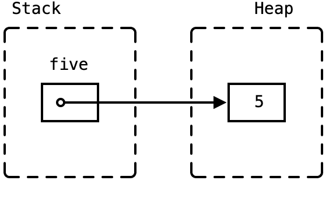

## Box
Box 是指向堆上数据的自有指针
`Box<T>` 会实现 `Deref<Target = T>`，这意味着可以直接在 `Box<T>` 上通过 `T` 调用相应方法。

```rust
fn main() {
    let five = Box::new(5);
    println!("five: {}", *five);
}
```



Box 类似于 C++中的 `std::unique_ptr`，只是它保证不为 null

- 在以下情况下，`Box` 可能会很实用：
    - 在编译时间遇到无法知晓大小的类型，但 Rust 编译器需要知道确切大小。
    - 想要转让大量数据的所有权。为避免在堆栈上复制大量数据，请改为将数据存储在 `Box` 中的堆上，以便仅移动指针。
## Rc
`Rc` 是引用计数的共享指针。

```rust
use std::rc::Rc;

fn main() {
    let a = Rc::new(10);
    let b = Rc::clone(&a);

    println!("a: {a}");
    println!("b: {b}");
}
```