Chrome的开发者工具是个很强大的东西，相信程序员们都不会陌生，不过有些小功能可能并不为大众所知，所以，写下这篇文章罗列一下可能你所不知道的功能，有的功能可能会比较实用，有的则不一定，也欢迎大家补充交流。

#### 代码格式化

有很多css/js的代码都会被 minify 掉，你可以点击代码窗口左下角的那个 **`{ }`**  标签，chrome会帮你给格式化掉。

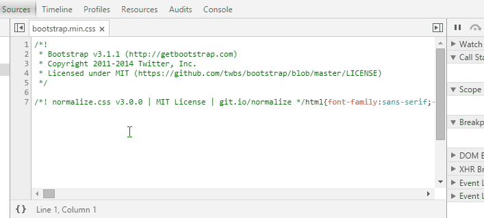

#### 强制DOM状态

有些HTML的DOM是有状态的，比如<a> 标签，其会有 active，hover， focus，visited这些状态，有时候，我们的CSS会来定关不同状态的样式，在分析网页查看网页上DOM的CSS样式时，我们可以点击CSS样式上的 **`:hov`** 这个小按钮来强制这个DOM的状态。

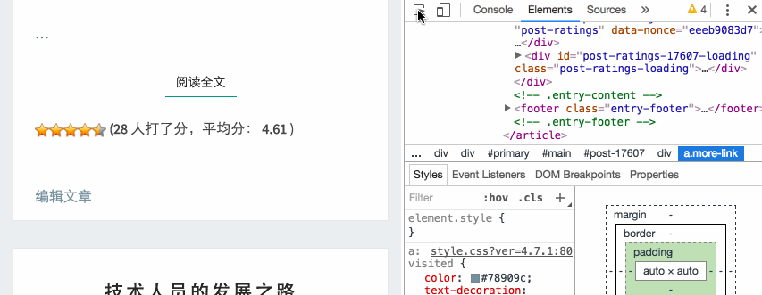

#### 动画

现在的网页上都会有一些动画效果。在Chrome的开发者工具中，通过右上角的菜单中的 `More Tools` => `Animations` 呼出相关的选项卡。于是你就可以慢动作播放动画了（可以点选 `25%` 或 `10%`），然后，Chrome还可以帮你把动画录下来，你可以拉动动再画的过程，甚至可以做一些简单的修改。

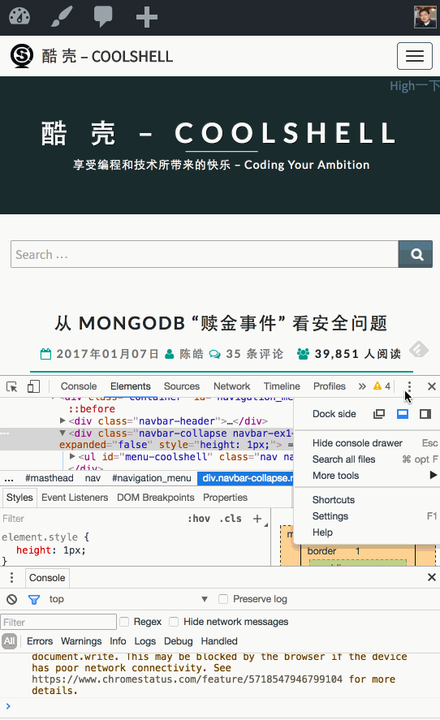

#### 直接编辑网页

在你的 console 里 输入下面的命令：

document.designMode = "on"

`document.designMode = "on"`

于是你就可以直接修改网页上的内容了。

P.S. 下面这个抓屏中还演示了一个如何清空console的示例。你可以输入 clear() 或是 按 `Ctrl+L`（Windows下），`CMD + K` (Mac下)

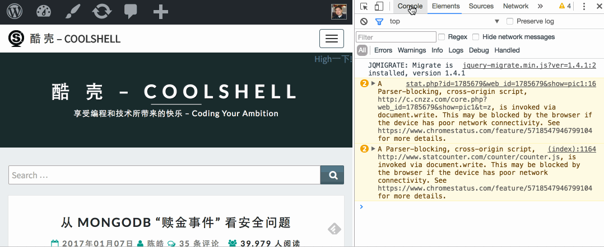

#### 网络限速

你可以设置你的网络的访问速度来模拟一个网络很慢的情况。

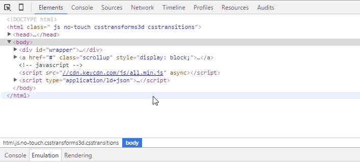

#### 复制HTTP请求

这个是我很喜欢 的一个功能，你可以在 network选项卡里，点击 XHR 过滤相关的Ajax请求，然后在相关的请求上点鼠标右键，在菜单中选择： `Copy` =\> `Copy as cURL`，然后就可以到你的命令行下去 执行 `curl` 的命令了。这个可以很容易做一些自动化的测试。

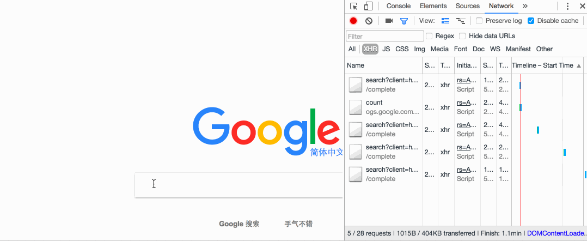

**友情提示：这个操作有可能会把你的个人隐私信息复制出去，比如你个人登录后的cookie。** 

#### 抓个带手机的图

这个可能有点无聊了，不过我觉得挺有意思的。

在device显示中，先选择一个手机，然后在右上角选 `Show Device Frame`，然后你就看到手机的样子了，然后再到那个菜中中选 Capture snapshot，就可以抓下一个有手机样子的截图了。

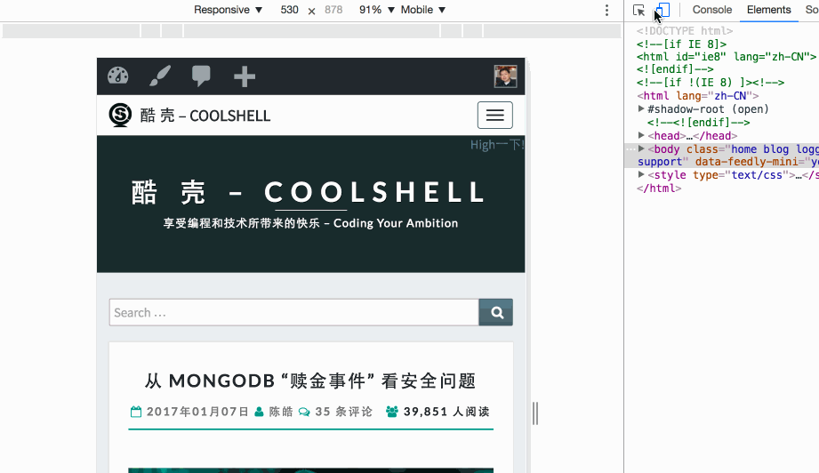

我抓的图如下（当然，不是所有的手机都有frame的）


#### 设置断点

除了给Javascript的源代码上设置断点调试，你还可以：

##### 给DOM设置断点

选中一个DOM，然后在右键菜单中选 Break on … 你可以看到如下三个选项：

#### 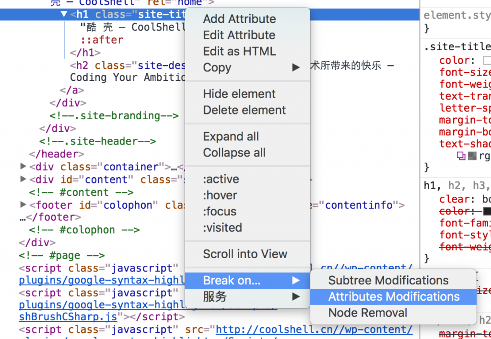

##### 给XHR和Event Lisener设置断点

在 Sources 面页中，你可以看到右边的那堆break points中，除了上面我们说的给DOM设置断点，你还可以给XHR和Event Listener设置断点，载图如下：

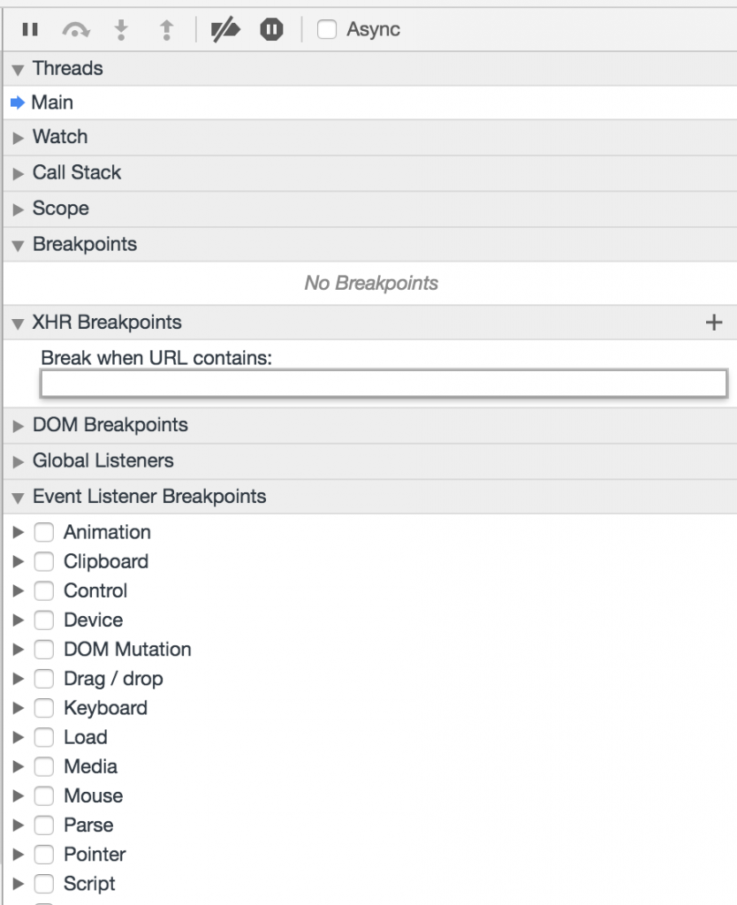

#### 关于Console中的技巧

##### DOM操作

*   chrome会帮你buffer 5个你查看过的DOM对象，你可以直接在Console中用 $0, $1, $2, $3, $4来访问。

*   你还可以使用像jQuery那样的语法来获得DOM对象，如：`$("#mydiv")`

*   你还可使用 `$$(".class")` 来选择所有满足条件的DOM对象。

*   你可以使用 `getEventListeners($("selector"))` 来查看某个DOM对象上的事件（如下图所示）。

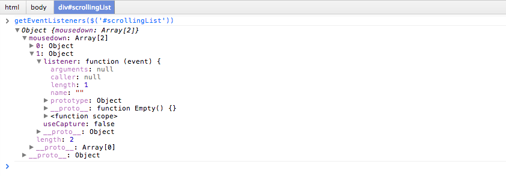

*   你还可以使用 `monitorEvents($("selector"))` 来监控相关的事件。比如：

monitorEvents(document.body, "click");

`monitorEvents(document.body, "click");`

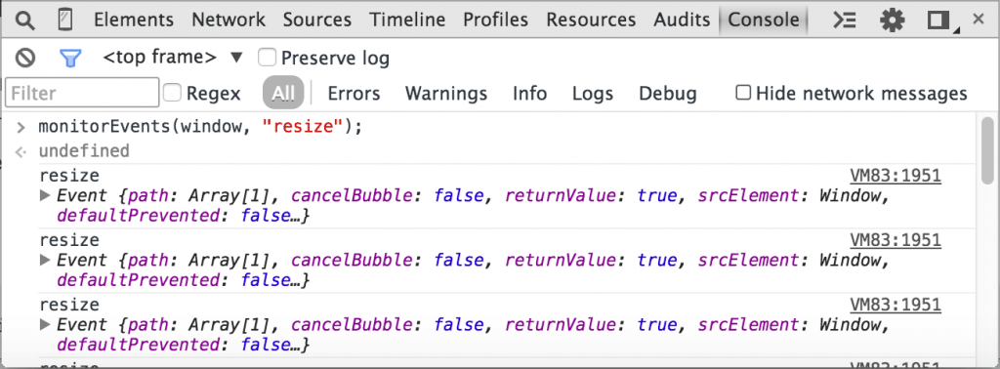

##### Console中的一些函数

**1）monitor函数**

使用 monitor函数来监控一函数，如下面的示例

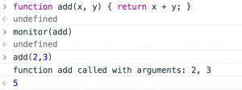

**2）copy函数**

copy函数可以把一个变量的值copy到剪贴板上。

**3）inspect函数**

inspect函数可以让你控制台跳到你需要查看的对象上。如：

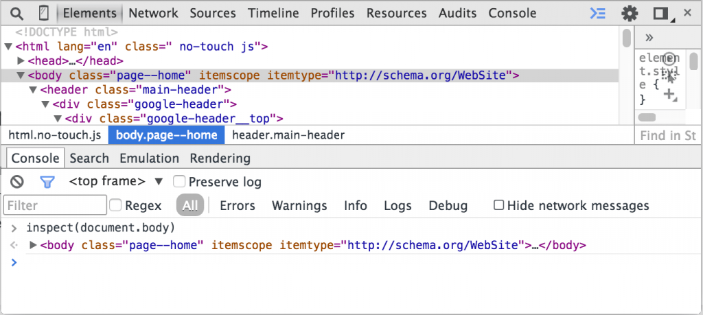

更多的函数请参数官方文档 – [Using the Console / Command Line Reference](https://developers.google.com/web/tools/chrome-devtools/console/command-line-reference)

##### Console的输出

我们知道，除了`console.log`之外，还有`console.debug`，`console.info`，`console.warn`，`console.error`这些不同级别的输出。另外一个鲜为人知的功能是，`console.log`中，你还可以对输出的文本加上css的样式，如下所示：

```
console.log("%c左耳朵", "font-size:90px;color:#888")
```


于是，你可以定义一些相关的log函数，如：

```
console.todo = function( msg){
  console.log( '%c%s %s %s', 'font-size:20px; color:yellow; background-color: blue;', '--', msg, '--');
}
console.important = function( msg){
  console.log( '%c%s %s %s', 'font-size:20px; color:brown; font-weight: bold; text-decoration: underline;', '--', msg, '--');
}
```

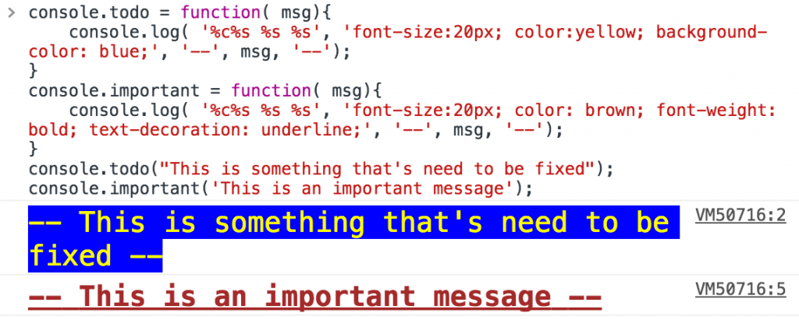

关于console.log中的格式化，你可以参看如下表格：

| 指示符   | 输出                           |
| -------- | ------------------------------ |
| %s       | 格式化输出一个字符串变量。     |
| %i or %d | 格式化输出一个整型变量的值。   |
| %f       | 格式化输出一个浮点数变量的值。 |
| %o       | 格式化输出一个DOM对象。        |
| %O       | 格式化输出一个Javascript对象。 |
| %c       | 为后面的字符串加上CSS样式      |

除了console.log打印js的数组，你还可以使用console.table来打印，如下所示：

```
var pets = [
  { animal: 'Horse', name: 'Pony', age: 23 },
  { animal: 'Dog', name: 'Snoopy', age: 13 },
  { animal: 'Cat', name: 'Tom', age: 18 },
  { animal: 'Mouse', name: 'Jerry', age: 12}
];
console.table(pets)
```

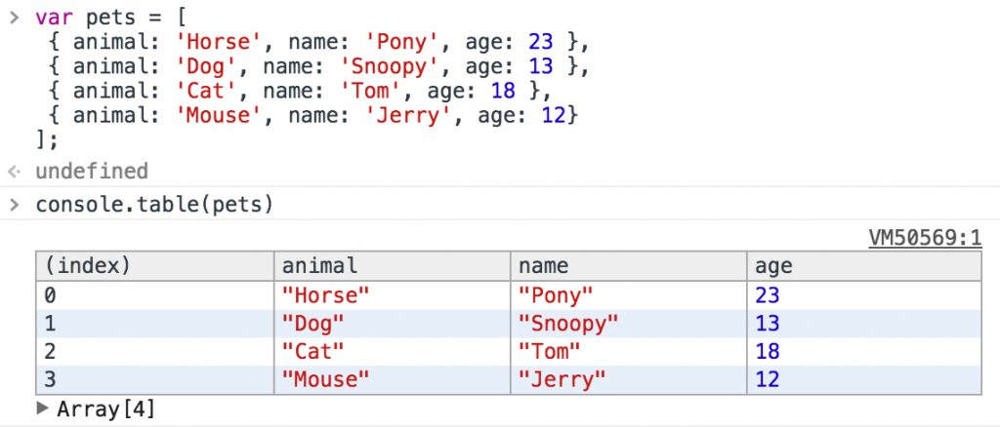

#### 关于console对象

*   console对象除了上面的打日志的功能，其还有很多功能，比如：
*   console.trace() 可以打出js的函数调用栈
*   console.time() 和 console.timeEnd() 可以帮你计算一段代码间消耗的时间。
*   console.profile() 和 console.profileEnd() 可以让你查看CPU的消耗。
*   console.count() 可以让你看到相同的日志当前被打印的次数。
*   console.assert(expression, object) 可以让你assert一个表达式

这些东西都可以看看[Google的Console API的文档](https://developers.google.com/web/tools/chrome-devtools/console/console-reference)。

其实，还有很多东西，你可以参看Google的官方文档 – [Chrome DevTools](https://developers.google.com/web/tools/chrome-devtools/)

#### 关于快捷键

点击在 DevTools的右上角的那三个坚排的小点，你会看到一个菜单，点选 `Shortcuts`，你就可以看到所有的快捷键了

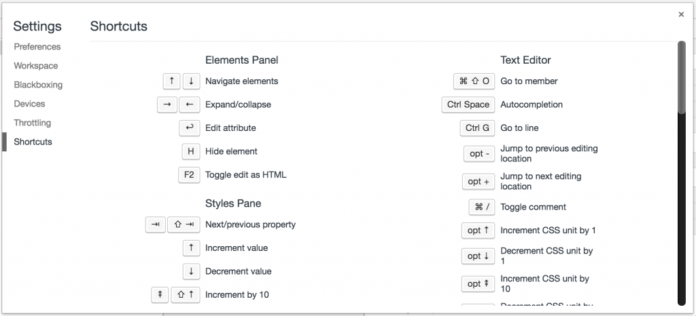


