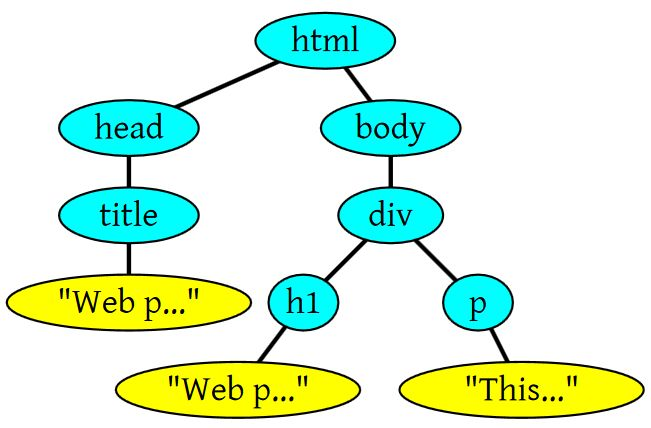

看到这个标题大家一定会想到这篇神文《[How Browsers Work](http://taligarsiel.com/Projects/howbrowserswork1.htm)》，这篇文章把浏览器的很多细节讲得很细，而且也被[翻译成了中文](http://ux.sohu.com/topics/50972d9ae7de3e752e0081ff)。为什么我还想写一篇呢？因为两个原因，

1）这篇文章太长了，阅读成本太大，不能一口气读完。

2）花了大力气读了这篇文章后可以了解很多，但似乎对工作没什么帮助。

所以，我准备写下这篇文章来解决上述两个问题。希望你能在上班途中，或是坐马桶时就能读完，并能从中学会一些能用在工作上的东西。


#### 浏览器工作大流程

废话少说，先来看个图：


从上面这个图中，我们可以看到那么几个事：

1）浏览器会解析三个东西：

- 一个是HTML/SVG/XHTML，事实上，Webkit有三个C++的类对应这三类文档。解析这三种文件会产生一个DOM Tree。

- CSS，解析CSS会产生CSS规则树。

- Javascript，脚本，主要是通过DOM API和CSSOM API来操作DOM Tree和CSS Rule Tree.

2）解析完成后，浏览器引擎会通过DOM Tree 和 CSS Rule Tree 来构造 Rendering Tree。注意：

- Rendering Tree 渲染树并不等同于DOM树，因为一些像Header或display:none的东西就没必要放在渲染树中了。

- CSS 的 Rule Tree主要是为了完成匹配并把CSS Rule附加上Rendering Tree上的每个Element。也就是DOM结点。也就是所谓的Frame。

- 然后，计算每个Frame（也就是每个Element）的位置，这又叫layout和reflow过程。

3）最后通过调用操作系统Native GUI的API绘制。

#### DOM解析

HTML的DOM Tree解析如下：

```html
<html>
<html>
<head>
    <title>Web page parsing</title>
</head>
<body>
    <div>
        <h1>Web page parsing</h1>
        <p>This is an example Web page.</p>
    </div>
</body>
</html>
```

上面这段HTML会解析成这样：



下面是另一个有SVG标签的情况。


#### CSS解析

CSS的解析大概是下面这个样子（下面主要说的是Gecko也就是Firefox的玩法），假设我们有下面的HTML文档：

```html
<doc>
<title>A few quotes</title>
<para>
  Franklin said that <quote>"A penny saved is a penny earned."</quote>
</para>
<para>
  FDR said <quote>"We have nothing to fear but <span>fear itself.</span>"</quote>
</para>
</doc>
```

于是DOM Tree是这个样子：


然后我们的CSS文档是这样的：

```css
/* rule 1 */ doc { display: block; text-indent: 1em; }
/* rule 2 */ title { display: block; font-size: 3em; }
/* rule 3 */ para { display: block; }
/* rule 4 */ [class="emph"] { font-style: italic; }
```

于是我们的CSS Rule Tree会是这个样子：


注意，图中的第4条规则出现了两次，一次是独立的，一次是在规则3的子结点。所以，我们可以知道，建立CSS Rule Tree是需要比照着DOM Tree来的。CSS匹配DOM Tree主要是从右到左解析CSS的Selector，好多人以为这个事会比较快，其实并不一定。关键还看我们的CSS的Selector怎么写了。

**注意：CSS匹配HTML元素是一个相当复杂和有性能问题的事情。所以，你就会在N多地方看到很多人都告诉你，DOM树要小，CSS尽量用id和class，千万不要过渡层叠下去，……**

通过这两个树，我们可以得到一个叫Style Context Tree，也就是下面这样（把CSS Rule结点Attach到DOM Tree上）：


所以，Firefox基本上来说是通过CSS 解析 生成 CSS Rule Tree，然后，通过比对DOM生成Style Context Tree，然后Firefox通过把Style Context Tree和其Render Tree（Frame Tree）关联上，就完成了。注意：Render Tree会把一些不可见的结点去除掉。而**Firefox中所谓的Frame就是一个DOM结点，不要被其名字所迷惑了**。


注：Webkit不像Firefox要用两个树来干这个，Webkit也有Style对象，它直接把这个Style对象存在了相应的DOM结点上了。

#### 渲染

渲染的流程基本上如下（黄色的四个步骤）：

1. 计算CSS样式
2. 构建Render Tree
3. Layout – 定位坐标和大小，是否换行，各种position, overflow, z-index属性 ……
4. 正式开画


注意：上图流程中有很多连接线，这表示了Javascript动态修改了DOM属性或是CSS属会导致重新Layout，有些改变不会，就是那些指到天上的箭头，比如，修改后的CSS rule没有被匹配到，等。

这里重要要说两个概念，一个是Reflow，另一个是Repaint。这两个不是一回事。

- Repaint——屏幕的一部分要重画，比如某个CSS的背景色变了。但是元素的几何尺寸没有变。

- Reflow——意味着元件的几何尺寸变了，我们需要重新验证并计算Render Tree。是Render Tree的一部分或全部发生了变化。这就是Reflow，或是Layout。（**HTML使用的是flow based layout，也就是流式布局，所以，如果某元件的几何尺寸发生了变化，需要重新布局，也就叫reflow**）reflow 会从<html>这个root frame开始递归往下，依次计算所有的结点几何尺寸和位置，在reflow过程中，可能会增加一些frame，比如一个文本字符串必需被包装起来。

下面是一个打开Wikipedia时的Layout/reflow的视频（注：HTML在初始化的时候也会做一次reflow，叫 intial reflow），你可以感受一下：


Reflow的成本比Repaint的成本高得多的多。DOM Tree里的每个结点都会有reflow方法，一个结点的reflow很有可能导致子结点，甚至父点以及同级结点的reflow。**在一些高性能的电脑上也许还没什么，但是如果reflow发生在手机上，那么这个过程是非常痛苦和耗电的**。


所以，下面这些动作有很大可能会是成本比较高的。

- 当你增加、删除、修改DOM结点时，会导致Reflow或Repaint
- 当你移动DOM的位置，或是搞个动画的时候。
- 当你修改CSS样式的时候。
- 当你Resize窗口的时候（移动端没有这个问题），或是滚动的时候。
- 当你修改网页的默认字体时。

注：display:none会触发reflow，而visibility:hidden只会触发repaint，因为没有发现位置变化。

多说两句关于滚屏的事，通常来说，如果在滚屏的时候，我们的页面上的所有的像素都会跟着滚动，那么性能上没什么问题，因为我们的显卡对于这种把全屏像素往上往下移的算法是很快。但是如果你有一个fixed的背景图，或是有些Element不跟着滚动，有些Elment是动画，那么这个滚动的动作对于浏览器来说会是相当相当痛苦的一个过程。你可以看到很多这样的网页在滚动的时候性能有多差。因为滚屏也有可能会造成reflow。

基本上来说，reflow有如下的几个原因：

- Initial。网页初始化的时候。
- Incremental。一些Javascript在操作DOM Tree时。
- Resize。其些元件的尺寸变了。
- StyleChange。如果CSS的属性发生变化了。
- Dirty。几个Incremental的reflow发生在同一个frame的子树上。

好了，我们来看一个示例吧：

```javascript
var bstyle = document.body.style; // cache

bstyle.padding = "20px"; // reflow, repaint
bstyle.border = "10px solid red"; //  再一次的 reflow 和 repaint

bstyle.color = "blue"; // repaint
bstyle.backgroundColor = "#fad"; // repaint

bstyle.fontSize = "2em"; // reflow, repaint

// new DOM element – reflow, repaint
document.body.appendChild(document.createTextNode(‘dude!’));
```

当然，我们的浏览器是聪明的，它不会像上面那样，你每改一次样式，它就reflow或repaint一次。**一般来说，浏览器会把这样的操作积攒一批，然后做一次reflow，这又叫异步reflow或增量异步reflow**。但是有些情况浏览器是不会这么做的，比如：resize窗口，改变了页面默认的字体，等。对于这些操作，浏览器会马上进行reflow。

但是有些时候，我们的脚本会阻止浏览器这么干，比如：如果我们请求下面的一些DOM值：

1. offsetTop, offsetLeft, offsetWidth, offsetHeight
2. scrollTop/Left/Width/Height
3. clientTop/Left/Width/Height
4. IE中的 getComputedStyle(), 或 currentStyle

因为，如果我们的程序需要这些值，那么浏览器需要返回最新的值，而这样一样会flush出去一些样式的改变，从而造成频繁的reflow/repaint。

#### 减少reflow/repaint

下面是一些Best Practices：

**1）不要一条一条地修改DOM的样式。与其这样，还不如预先定义好css的class，然后修改DOM的className。**

```javascript
// bad
var left = 10,
top = 10;
el.style.left = left + "px";
el.style.top = top + "px";

// Good
el.className += " theclassname";

// Good
el.style.cssText += "; left: " + left + "px; top: " + top + "px;";
```

**2）把DOM离线后修改。如：**

- 使用documentFragment 对象在内存里操作DOM
- 先把DOM给display:none(有一次reflow)，然后你想怎么改就怎么改。比如修改100次，然后再把他显示出来。
- clone一个DOM结点到内存里，然后想怎么改就怎么改，改完后，和在线的那个的交换一下。

3）**不要把DOM结点的属性值放在一个循环里当成循环里的变量。**不然这会导致大量地读写这个结点的属性。

4）**尽可能的修改层级比较低的DOM**。当然，改变层级比较底的DOM有可能会造成大面积的reflow，但是也可能影响范围很小。

5）**为动画的HTML元件使用fixed或absoult的position**，那么修改他们的CSS是不会reflow的。

6）**千万不要使用table布局**。因为可能很小的一个小改动会造成整个table的重新布局。

> In this manner, the user agent can begin to lay out the table once the entire first row has been received. Cells in subsequent rows do not affect column widths. Any cell that has content that overflows uses the ‘overflow’ property to determine whether to clip the overflow content.
>
> [Fixed layout, CSS 2.1 Specification](http://www.w3.org/TR/CSS21/tables.html#fixed-table-layout)

> This algorithm may be inefficient since it requires the user agent to have access to all the content in the table before determining the final layout and may demand more than one pass.
>
> [Automatic layout, CSS 2.1 Specification](http://www.w3.org/TR/CSS21/tables.html#auto-table-layout)

#### 几个工具和几篇文章

有时候，你会也许会发现在IE下，你不知道你修改了什么东西，结果CPU一下子就上去了到100%，然后过了好几秒钟repaint/reflow才完成，这种事情以IE的年代时经常发生。所以，我们需要一些工具帮我们看看我们的代码里有没有什么不合适的东西。

- Chrome下，Google的[SpeedTracer](https://code.google.com/webtoolkit/speedtracer/)是个非常强悍的工作让你看看你的浏览渲染的成本有多大。其实Safari和Chrome都可以使用开发者工具里的一个Timeline的东东。

- Firefox下这个基于Firebug的叫[Firebug Paint Events](https://addons.mozilla.org/en-US/firefox/addon/firebug-paint-events/)的插件也不错。

- IE下你可以用一个叫[dynaTrace](http://ajax.dynatrace.com/pages/)的IE扩展。

最后，别忘了下面这几篇提高浏览器性能的文章：

- [Google – Web Performance Best Practices](https://code.google.com/speed/page-speed/docs/rules_intro.html)
- [Yahoo – Best Practices for Speeding Up Your Web Site](http://developer.yahoo.com/performance/rules.html)
- [Steve Souders – 14 Rules for Faster-Loading Web Sites](http://stevesouders.com/hpws/rules.php)

#### 参考

- David Baron的演讲：Fast CSS: How Browsers Lay Out Web Pages：[slideshow](https://dbaron.org/talks/2012-03-11-sxsw/slide-1.xhtml), [all slides](https://dbaron.org/talks/2012-03-11-sxsw/master.xhtml), [audio (MP3)](http://audio.sxsw.com/2012/podcasts/11-ACC-Fast_CSS_How_Browser_Layout.mp3), [Session page](http://schedule.sxsw.com/2012/events/event_IAP12909), [Lanyrd page](http://lanyrd.com/2012/sxsw-interactive/spmbt/)

- How Browsers Work: http://taligarsiel.com/Projects/howbrowserswork1.htm

- Mozilla 的 Style System Overview：https://developer.mozilla.org/en-US/docs/Style_System_Overview

- Mozilla 的 Note of reflow： http://www-archive.mozilla.org/newlayout/doc/reflow.html

- Rendering: repaint, reflow/relayout, restyle：http://www.phpied.com/rendering-repaint-reflowrelayout-restyle/

- Effective Rendering CSS：[http://css-tricks.com/efficiently-rendering-css/](https://css-tricks.com/efficiently-rendering-css/)

- Webkit Rendering文档：http://trac.webkit.org/wiki/WebCoreRendering