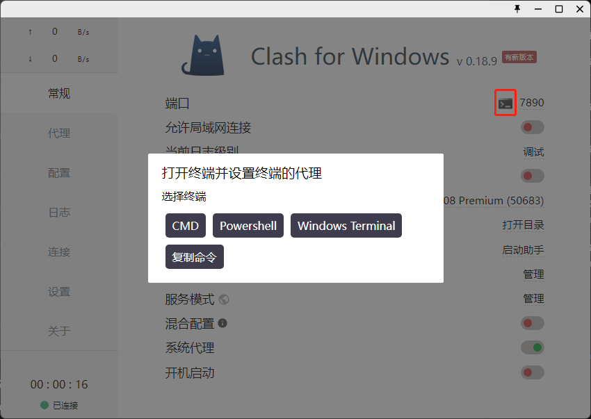

## Windows

### PowerShell

设置代理：

```powershell
$env:http_proxy="http://proxy.example.com:8080"
$env:https_proxy="http://proxy.example.com:8080"
$env:no_proxy="localhost,127.0.0.1,example.com"
```

> 如果希望配置持续生效，可以将环境变量加入到系统环境变量中。

取消代理：

```powershell
$env:http_proxy=""
$env:https_proxy=""
$env:no_proxy=""
```

**验证设置代理是否成功**

```powershell
curl.exe -I google.com
```

或者替换为想要访问的域名，如果有响应，那么就设置成功。

### cmd

设置代理：

```batch
set http_proxy=http://proxy.example.com:8080
set https_proxy=http://proxy.example.com:8080
set no_proxy=localhost,127.0.0.1,example.com
```

取消代理：

```batch
set http_proxy=
set https_proxy=
set no_proxy=
```

----

最简单方法设置代理，通过clash直接选择对应的终端，打开之后即是设置好代理的终端。



## Linux

### Shell

设置代理：

```bash
export http_proxy=http://proxy.example.com:8080
export https_proxy=http://proxy.example.com:8080
export all_proxy=http://proxy.example.com:8080
export no_proxy=localhost,127.0.0.1,example.com
```

> 如果希望配置持续生效，可以写入到 `.bashrc`/`.zshrc` 等文件中。

取消代理：

```bash
unset http_proxy
unset https_proxy
unset all_proxy
unset no_proxy
```

查看设置的代理

```shell
echo $http_proxy
echo $https_proxy
echo $no_proxy
```

或者直接查看所有代理

```
env | grep proxy
```


## WSL

这里主要指WSL2

首先需要代理软件，如Clash，设置**允许局域网**（Allow LAN）开关为打开状态


然后，代理的IP不是127.0.0.1，而是本机的IP，这里需要特别注意，本机IP在`/etc/resolv.conf`进行查看

```
leoya@DESKTOP-30Q198G:~$ cat /etc/resolv.conf
# This file was automatically generated by WSL. To stop automatic generation of this file, add the following entry to /etc/wsl.conf:
# [network]
# generateResolvConf = false
nameserver 172.31.64.1
```

nameserver 这行就是需要的本机 IP。

可以通过以下代码直接设置代理

```shell
export HOSTIP=$(cat /etc/resolv.conf | grep "nameserver" | cut -f 2 -d " ")
export http_proxy="http://$HOSTIP:7890"
export https_proxy="http://$HOSTIP:7890"

#或者
export windows_host=`cat /etc/resolv.conf|grep nameserver|awk '{print $2}'`
```


----

> [在 WSL2 中使用 Clash for Windows 代理连接](https://eastmonster.github.io/2022/10/05/clash-config-in-wsl/)
